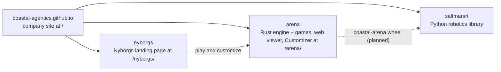

# Arena, a Coastal Agentics project

**Coastal Agentics: behavioral design for agents.** Coastal Agentics is an open source robotics company in Savannah, Georgia: we train agents in simulation and move them onto physical robots. Our tools and methods are open, reward functions are published, and every dataset records who made it.

Founded October 1, 2026.

- Site: https://coastal-agentics.github.io/arena/ (live viewer: [Tank Arena](https://coastal-agentics.github.io/arena/arena.html) · [Nyborg kart racing](https://coastal-agentics.github.io/arena/arena.html?game=racing))
- Nyborgs, the agents that play here: https://coastal-agentics.github.io/nyborgs/ ([Coastal-Agentics/nyborgs](https://github.com/Coastal-Agentics/nyborgs))
- Company site: https://coastal-agentics.github.io/ ([Coastal-Agentics/coastal-agentics.github.io](https://github.com/Coastal-Agentics/coastal-agentics.github.io))
- Field notes: [docs/fieldnotes/](docs/fieldnotes/) · [on the site](https://coastal-agentics.github.io/arena/fieldnotes.html)

This repo is the **arena**: a small deterministic Rust engine, the Tank Arena and Nyborg racing games, and the GitHub Pages site under `web/` (themed to match the company site; ADR-016). The browser viewer is live with Tank Arena rules-v1 (#18): 9-point loadouts, Charger/Kiter/Sniper policies, and a Customize tab with shareable links. The legacy built-in-bot viewer remains available. The company is run by agents: a Chief of Staff (Soundwave) plans, dispatches workers (Shockwave, Engine Lead; Blitzwing, Tank Designer-Developer), merges on green CI, and reports to the founder, Nye Warburton (Creative Director).

Status: **Phase 2 (Tank Arena)**. Rules-v1 is live (#18) with 9-point loadouts, Charger/Kiter/Sniper policies, and the Customize tab with shareable links. The Watch-tab fix is in (#20), and the viewer browser check runs in CI (#21). See [docs/STATE.md](docs/STATE.md).

## How the repos fit

Coastal Agentics has four public repos. They all live in the [Coastal-Agentics](https://github.com/Coastal-Agentics) GitHub org, and their sites are served together under one host.



| Repo | What it is | Owner |
| --- | --- | --- |
| [coastal-agentics.github.io](https://github.com/Coastal-Agentics/coastal-agentics.github.io) | The company site, served at `/` ([site](https://coastal-agentics.github.io/)) | Soundwave (legal pages: Onslaught) |
| [nyborgs](https://github.com/Coastal-Agentics/nyborgs) | The Nyborgs landing page, served at `/nyborgs/` ([site](https://coastal-agentics.github.io/nyborgs/)) | Blitzwing |
| [arena](https://github.com/Coastal-Agentics/arena) | The Rust engine (`engine`, `engine-cli`, `engine-wasm`, and `engine-py`, the `coastal-arena` Python wheel) plus the Tank Arena and racing games, the web viewer and the Nyborg Customizer, served at `/arena/` ([site](https://coastal-agentics.github.io/arena/)) | Engine: Shockwave. Games, web viewer and Customizer: Blitzwing |
| [saltmarsh](https://github.com/Coastal-Agentics/saltmarsh) | The Python robotics library: MuJoCo simulation, datasets, behavior and evaluation, and the robot arm demo | Shockwave |

"Saltmarsh" means only the Python robotics library. The engine is the Arena engine, and it lives in `arena`.

## Layout
```
engine/        Rust sim core: deterministic 60 Hz, replays (also compiles to wasm); today it also
               holds the tank step rules, TankParams and observations/actions (ADR-009, ADR-014)
engine-cli/    headless runner: N matches -> JSON (source of truth for CI)
engine-wasm/   browser bindings for the viewer (wasm-bindgen), built into web/pkg
engine-py/     Python bindings (pyo3, maturin): the coastal-arena wheel, its own Cargo workspace
games/tank/    Tank Arena rules v1: loadouts, arena and spawns, scripted policies, and the
               placeholder bots Chaser and Wanderer used by engine-cli and the viewer's built-in-bot mode
web/           the GitHub Pages site: viewer + field notes (static; the only generated file is
               web/fieldnotes/index.json, built from web/fieldnotes/cards/)
docs/          charter, state, decisions, provenance card, role briefs, field notes, playbooks
.github/       CI, nightly and Pages workflows
```

## Run it
Requires Rust stable (pinned via `rust-toolchain.toml`).
```sh
cargo test --workspace
cargo run -p engine-cli -- --matches 10 --seed 42
cargo build -p engine --target wasm32-unknown-unknown
```

Preview the site locally. The field notes page reads `web/fieldnotes/index.json`, which is generated and not committed, so build it first:
```sh
node scripts/fieldnotes_index.mjs        # Node 20+; writes web/fieldnotes/index.json
python3 -m http.server -d web 8000       # open http://localhost:8000/fieldnotes.html
```

## Docs
- [Charter](docs/CHARTER.md): how the company runs
- [State](docs/STATE.md): what's happening now
- [Decisions](docs/DECISIONS.md): architecture decision records
- [Card](docs/CARD.md): provenance card for every shipped artifact
- [Engine](docs/engine/): how the engine, engine-cli, replays and the wasm viewer work
- [Roles](docs/roles/): worker briefs
- [Field notes](docs/fieldnotes/): one entry per merged PR
- [Playbooks](docs/playbooks/): what each phase taught us

## Contributing
Issues and PRs from outside the company are welcome as information, but they are not merged or acted on without Nye's approval.

## License
[MIT](LICENSE)
