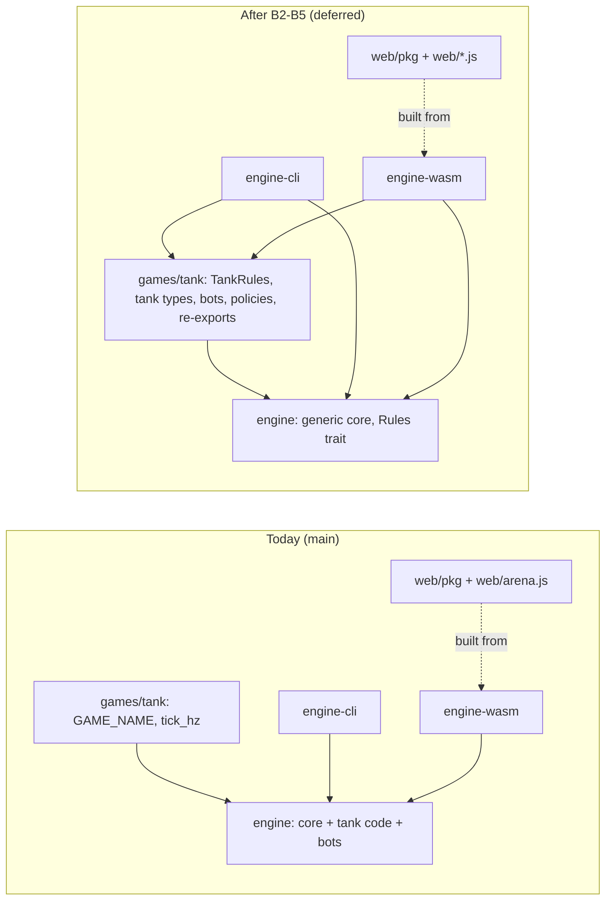

# Architecture Decision Records

Short ADRs. Status is one of: Accepted, Proposed, Open, Superseded.

## ADR-001 — Own engine, not Bevy
**Status:** Accepted (2026-09-27)
**Context:** The POC needs a tiny deterministic 2D sim that runs headless in CI and in the browser.
**Decision:** Write our own small engine crate (`engine/`). No Bevy for the POC.
**Why:** Small surface agents can hold in their heads; full control over determinism, step order and wasm size; fast CI builds.
**Cost:** We build what Bevy would give us (rendering glue, ECS-ish structure). Acceptable at POC scale.

## ADR-002 — Canvas 2D, not wgpu
**Status:** Accepted (2026-09-27; corrected 2026-09-30: drawn from plain JavaScript, not `web-sys`)
**Decision:** The browser viewer draws with the Canvas 2D API via `web-sys`.
**Why:** Tanks, shots and HP bars need nothing more; no GPU feature detection; smaller wasm; works everywhere.
**Revisit:** If a later prototype needs thousands of sprites or shaders.
**Correction (2026-09-30):** The viewer as built (#8) draws with the Canvas 2D API from plain JavaScript (`web/arena.js`); `web-sys` is not used. The wasm module (`engine-wasm`) only runs the sim and hands the state to JS as JSON. Canvas 2D instead of wgpu stands. See `docs/engine/wasm-and-web.md`.

## ADR-003 — Determinism policy
**Status:** Accepted (2026-09-27)
- Fixed timestep at **60 Hz**; the sim never uses wall-clock time.
- All randomness from a seeded **`rand_chacha`** RNG passed explicitly; no global or OS RNG in the sim.
- Guarantee: **same seed → same match on the same platform**. Cross-platform bit-determinism is a stretch goal.
- **Avoid transcendental float functions** (`sin`, `cos`, `atan2`, `sqrt` where avoidable) in the sim core; prefer lookup tables or integer/fixed math.
- Deterministic iteration order (no `HashMap` iteration in sim logic).
- The headless `engine-cli` is the source of truth; CI checks that a seed reproduces a match.

## ADR-004 — Vercel instead of GitHub Pages
**Status:** Superseded by ADR-008 (2026-09-30)
**Decision:** The public site is hosted on Vercel. Vercel's Git integration deploys `web/` on merge to `main`. No `pages.yml`.
**Why:** Nye's choice; preview deploys per PR; simple custom domain later.
**Pending:** Nye imports the project and chooses a plan tier (gated).

## ADR-005 — How the wasm build reaches Vercel
**Status:** Superseded by ADR-008 (2026-09-30), which answers it: wasm is committed under `web/pkg` and deployed as static files
**Context:** The viewer needs the `engine` (and `games/tank`) compiled to wasm. Vercel's default build image has no Rust toolchain.
**Options:**
1. **Build wasm in GitHub Actions, deploy via Vercel CLI.** CI already builds wasm; reuses cache; needs a Vercel token stored as a GitHub secret (credential gate) and a deploy job in `.github/workflows/`.
2. **Build on Vercel with a Rust toolchain install.** A build command installs rustup + `wasm32-unknown-unknown` + `wasm-bindgen-cli`, then builds. No secrets in GitHub; slower builds; depends on Vercel build-time limits of the chosen plan.
**Decide by:** before the Phase 2 deploy. Needs Nye's input on credentials and plan tier.

## ADR-006 — Vercel Hobby tier for the POC
**Status:** Superseded by ADR-008 (2026-09-30); Vercel is dropped, so GATE-001's plan tier no longer applies
**Decision:** The proof of concept runs on Vercel's **Hobby** plan. Move to **Pro** before anything commercial.
**Implications:** Hobby build-time and usage limits apply; factor them into ADR-005 (building wasm on Vercel vs. in GitHub Actions).

## ADR-007 — Nightly publishes to an unprotected `nightly-data` branch (no new credentials)
**Status:** Accepted (2026-09-27; replaces a first version of this ADR the same day)
**Context:** `main` requires the `lint`, `test` and `wasm` checks. The nightly job has only the default `GITHUB_TOKEN`: it cannot bypass classic branch protection, and pushes/PRs it makes don't trigger CI normally.
**Options considered:**
1. *Dispatch `ci.yml` on a temp branch, then fast-forward `main`.* Shipped first, then **tested and rejected**: GitHub documents that checks from `workflow_dispatch` runs never satisfy required checks, and the push was refused ("3 of 3 required status checks are expected").
2. *Ruleset with GitHub Actions as bypass actor.* Rejected: bypass can't be limited to paths, so any workflow with write access could skip CI on `main`.
3. *Bot PR + auto-merge.* Rejected: needs the "allow Actions to create PRs" setting, and CI on a `GITHUB_TOKEN` PR waits for a human to approve the run.
4. *PAT or GitHub App token.* Rejected: new credential (gated).
5. **Chosen: unprotected `nightly-data` branch.** The nightly merges `main` into `nightly-data`, commits results (only `web/data/`, `docs/fieldnotes/` (was `docs/devlog/` before ADR-011); anything else fails the job), and pushes (never force). `main` protection is untouched.
**Consequences:**
- The site reads live nightly data from `nightly-data` (e.g. `raw.githubusercontent.com/starscream-agentics/arena/nightly-data/web/data/...`); wire this in Phase 3.
- The CoS folds `nightly-data` into `main` by a normal PR in its daily work cycle, so CI checks it and nightly devlog entries reach `main`.
- `nightly-data` holds saved data: deleting or force-pushing it is a Nye gate.

## ADR-008 — GitHub Pages instead of Vercel; wasm committed under `web/pkg`
**Status:** Accepted (2026-09-30, Nye approved the restructure). Supersedes ADR-004 and ADR-006; answers ADR-005.
**Decision:** The public site is GitHub Pages, deployed by `.github/workflows/pages.yml` on push to `main` using the official actions (`configure-pages`, `upload-pages-artifact`, `deploy-pages`). `web/` is uploaded as-is: no build step. The wasm build and its JS glue are committed under `web/pkg` and served as static files. `web/vercel.json` is removed.
**Why:** No new account, token or plan tier; the deploy lives next to CI where the CoS owns it; the repo stays self-contained. Answers ADR-005 without a secret or a Rust toolchain on a host.
**Cost:** No per-PR preview deploys. Committed wasm must be rebuilt in the same PR as engine changes; the Engine Lead's brief says so.
**URL:** `https://starscream-agentics.github.io/arena/` (stays there; ADR-013).

## ADR-009 — The engine core is generic; tank specifics live in `games/tank`
**Status:** Accepted (2026-09-30; corrected 2026-09-30: this is the target layout, not yet the code)
**Decision:** `engine/` holds only the generic sim: fixed step, seeded RNG, arena, entities, match lifecycle, replay, the `Policy` trait. Tank rules, tank observations/actions and tank policies live in `games/tank`. New tank features never land in `engine/`.
**Why:** Coastal Agentics trains robots; the same core should later carry other bodies. Keeping game logic out of the core keeps it small and reusable.
**Correction (2026-09-30):** The code does not match this yet. Today the tank specifics live in `engine/`: the `Tank` and `Projectile` entities, `TankParams`, `TankSpawn`, `MatchConfig::duel` and the tank step rules (driving, turret, firing, hits) in `sim.rs`; the tank `Observation`/`Action` pair, with the `Policy` trait typed on them, in `policy.rs`; and the placeholder policies `Chaser` and `Wanderer` in `bots.rs`. `games/tank` is a stub (`GAME_NAME`, `tick_hz()`) waiting on the Tank Arena spec (GATE-002). See `docs/engine/`.
**Future work:** Move the tank-specific code from `engine/` into `games/tank` so `engine/` is the generic core this ADR describes. Not scheduled; no code has moved.
**Amended by ADR-014 (2026-09-30):** the move is planned in two phases (bots first, then a generic core with a `Rules` trait). Only the generic core inside `engine/` (B1) is approved; moving the tank rules into `games/tank` is deferred until a second Rust game exists. Transition re-exports, if ever needed, live in `games/tank`, never in `engine`.
**Update (2026-09-30):** ADR-014 Phase A is done. `Chaser` and `Wanderer` live in `games/tank` (`tank::{Chaser, Wanderer}`), `engine-cli` and `engine-wasm` use them, and `engine::bots` is deleted. The rest of the correction stands: the tank entities, `TankParams`, `TankSpawn`, the step rules and the tank `Observation`/`Action` are still in `engine/`. (`games/tank` is no longer a stub: it has held the Tank Arena rules v1 since #18.)

## ADR-010 — The Rust core is a candidate browser viewer for Saltmarsh
**Status:** Open (candidate, 2026-09-30)
**Context:** The second project is a Saltmarsh world (MuJoCo, Python). Training and physics stay in Python/MuJoCo.
**Proposal:** Reuse the Rust core compiled to wasm to play back Saltmarsh replays or logged states in the browser, so the site can show trained behavior without a Python runtime.
**Decide by:** when Saltmarsh is proposed to Nye as a gate. Alternative: a MuJoCo-native web viewer.

## ADR-011 — Renamed to Coastal Agentics
**Status:** Accepted (2026-09-30)
**Decision:** Starscream Agentics is now **Coastal Agentics** (Savannah, Georgia): "We train robots, with open tools, on the Georgia coast." Founded on GitHub October 1, 2026. The repo `starscream` is renamed `arena` (GitHub redirects the old URL); the `starscream-agentics` org keeps its name (ADR-013). The devlog is now field notes (`docs/fieldnotes/`, `web/fieldnotes.html`; `web/devlog.html` redirects). Email prefixes are `[COASTAL]`. Crate names are unchanged.

## ADR-012 — Tank demo stays 2D canvas; 3D environment is future work
**Status:** Accepted for the 2D demo (founder decision, 2026-09-30). The 3D work is future work, **not scheduled**.
**Decision:** The Tank Arena demo stays a 2D canvas viewer (ADR-002). No 3D work in the tank POC.
**Future work:** We will need a 3D environment for objects moving in space. Candidate renderer: **Bevy**, reading the same match data (replays/state logs) the engine already produces, so the sim stays unchanged. It could become a shared viewer for Saltmarsh/MuJoCo worlds too (see ADR-010). Revisits ADR-001 for rendering only, not for the sim core.
**Decide by:** when a project needs 3D; the CoS proposes it to Nye as a gate then.

## ADR-013 — `starscream-agentics` stays; the company site gets its own org later
**Status:** Accepted (founder decision, 2026-09-30). Replaces the planned org rename in ADR-011.
**Decision:** The `starscream-agentics` GitHub org is **not** renamed. It stays the home for simulations; this repo and its site remain at `https://starscream-agentics.github.io/arena/`. A separate `coastal-agentics` org will host the company site at `https://coastal-agentics.github.io` later (not scheduled).
**Consequences:** No URL change for the arena site, the repo or `nightly-data` links. The "rename org" task and blocker are closed.

## ADR-014 — Phase B: a generic sim core (moving the tank rules to `games/tank` deferred)
**Status:** Accepted (2026-09-30; CoS decision on internal architecture, no founder gate). Amends ADR-009: it plans the "Future work" move in two phases and fixes where any transition re-exports live. **Only step B1 is approved**; B2–B5 are deferred (see Sequencing).
**Progress (2026-09-30):**
- **Phase A is done.** In step 1 (#19, Blitzwing), the bots were copied into `games/tank` with their hash pins. In step 2 (Shockwave), `engine-cli` and `engine-wasm` switched to `tank::{Chaser, Wanderer}` and `engine::bots` was deleted.
- **Hash pins.** The Chaser vs Wanderer pins named below (`documented_hashes_are_unchanged`, plus the seeds 0–199 digest) now live in `games/tank/src/bots.rs`. `engine` pins its own hashes with test-only policies (`engine/src/testing.rs`), and `engine-cli` pins the rows its docs quote.
- **rules-v1** has merged (#18).
- **B1 is built, pending merge (PR #30, Shockwave).** `engine::generic` holds `Rules`, `Match<R>`, `Replay<R>`, `ReplayPlayer<R>`, `Policy<R = TankRules>`, `MatchRng` and `StateHasher`; `TankRules` implements `Rules` inside `engine`, and `engine::Match`, `Replay` and `ReplayPlayer` are aliases for the tank instances. `engine-cli`, `engine-wasm` and `games/tank` compile unchanged. `engine-cli` output (seeds 0–199 and others), 200 replay files and the wasm hashes in headless Chrome are byte-identical to `main`; run time is unchanged within noise. The trait signatures are the sketch's, unchanged; the details that differ are in the note below.
**Context:** Blitzwing proposed moving the tank code out of `engine/` in two phases. **Phase A** moves the placeholder bots: Blitzwing copies `Chaser` and `Wanderer` into `games/tank` with hash-pinned tests, then an engine PR switches `engine-cli` and `engine-wasm` to those copies and deletes `engine::bots`. **Phase B**, this ADR, makes the sim core generic. What is tank-specific in `engine/` on `main` (`d4db1c5`, which includes the #16 API):
- `sim.rs`:
  - config types: `TankParams` (including `projectile_spread_still`), `TankSpawn` (including `params: Option<TankParams>`), and `MatchConfig` with `duel()` and `tank_params()`;
  - entities and results: `Tank`, `Projectile`, `Event`, `EndReason`, `Outcome`;
  - `Match`: the tank step rules (plan moves, apply them simultaneously, fire, sweep projectiles, deaths), `observe` (including `max_hp` and `los`), the team-based end check, and `state_hash`, which hashes tank and projectile fields. The same file also holds the generic parts: tick counter, seeded RNG, action history, tick limit.
- `policy.rs`: `Action`, `Observation`, `SelfObs`, `TankObs` (`max_hp`, `los`), `ProjectileObs`, `WallObs`, `MAX_OBSERVED_*`, and the `Policy` trait, which is typed on the tank `Observation` and `Action`.
- `bots.rs`: `Chaser`, `Wanderer` (Phase A).
- `replay.rs`: generic in shape (`Replay`, `ReplayPlayer`, `setup_hash`, `REPLAY_FORMAT = 4`) but typed on `Match`, `MatchConfig`, `Action` and `Outcome`. Its `FieldNotInFormat` check reads tank fields (`tanks[].params`, `params.projectile_spread_still`).
- Already generic and staying put: `angle.rs` (`Heading`, the sin/cos table, `turn_toward`), `arena.rs` (`Arena`, `Rect`, `segment_clear`, the swept tests), `json_u64.rs`, `TICK_HZ`, `DT`.

Callers today:
- `engine-cli` and `engine-wasm` import `engine::{Match, MatchConfig, …}` and `engine::bots`.
- On the unmerged `tank/rules-v1` branch (no PR yet), `games/tank` builds loadouts, policies and match specs on `engine::{Match, MatchConfig, TankParams, TankSpawn, Observation, TankObs, Action, Policy, …}`, and `engine-wasm` gains a dependency on `tank`.

**Decision:**
- **Approved now: B1 only.** `engine` gets a generic core: a `Rules` trait and `Match`, `Policy` and `Replay` generic over it. The tank rules are implemented as `TankRules` **still inside `engine`**, behind the same public names and paths.
- **Deferred: B2–B5**, the move of the tank rules into `games/tank`. They wait until a second Rust game actually exists. The next project, Saltmarsh, is Python/MuJoCo (ADR-010), so B2–B5 may never be needed.
- **End state, if B2–B5 go ahead:** `engine` keeps everything that makes a match deterministic and replayable and knows nothing about tanks, while `games/tank` (crate `tank`) implements the tank rules against the trait.

Trait sketch (**a sketch, not code on `main`**; B1 settles the exact signatures):
```rust
// engine (sketch)
pub trait Rules {
    type Config: Clone + PartialEq + Serialize + DeserializeOwned; // replayed; hashed by setup_hash
    type State: Clone;
    type Action: Copy + Default + PartialEq + Serialize + DeserializeOwned;
    type Observation;
    type Event;
    fn init(config: &Self::Config, rng: &mut MatchRng) -> Self::State;          // e.g. spawns (draws in a documented order)
    fn agents(state: &Self::State) -> usize;                                     // entries per tick in the action list
    fn is_active(state: &Self::State, agent: usize) -> bool;                     // false: policy not called, default action
    fn sanitize(action: Self::Action) -> Self::Action;                           // what is recorded (tank: clamp to [-1, 1])
    fn step(config: &Self::Config, state: &mut Self::State, actions: &[Self::Action],
            rng: &mut MatchRng, events: &mut Vec<Self::Event>);                  // one fixed tick
    fn observe(config: &Self::Config, state: &Self::State, agent: usize, tick: u32) -> Self::Observation;
    fn outcome(config: &Self::Config, state: &Self::State, tick: u32) -> Option<Outcome>; // tank keeps its order: all destroyed, last standing, tick limit
    fn hash_state(state: &Self::State, h: &mut StateHasher);                     // engine hashes the tick first
    fn check_format(config: &Self::Config, format: u32) -> Result<(), &'static str>; // today's FieldNotInFormat rule
}
pub struct Match<R: Rules> { /* config, seed, rng, tick, state, events, outcome, history: Vec<Vec<R::Action>> */ }
pub trait Policy<R: Rules> { fn act(&mut self, obs: &R::Observation) -> R::Action; }
pub struct Replay<R: Rules> { /* format, engine_version, seed, config: R::Config, actions, outcome, final_hash, setup_hash */ }
```
**Note (2026-09-30, B1 as built):** the `Rules` trait landed with exactly the sketch's associated types and functions. The details the sketch left open, or that came out differently:
- The module is `engine::generic` (`generic::Match`, `generic::Replay`, `generic::ReplayPlayer`, `generic::Policy`). The crate root also re-exports `Rules`, `MatchRng`, `StateHasher`, `TankRules` and `TankState`.
- `MatchRng` is a newtype over the `ChaCha8Rng`. Only the engine can construct it, and it exposes just `next_u32` and `next_u64` (plus `Clone` and `Debug`), so a rules crate can't seed its own match RNG.
- `StateHasher` is a public FNV-1a builder (`new`, `write_u64`, `finish`).
- `Outcome` and `EndReason` moved into `generic` and are re-exported from `sim` and the crate root, so their paths are unchanged. `ReplayError`, `REPLAY_FORMAT` and `OLDEST_READABLE_FORMAT` also live in `generic`, re-exported from `engine::replay`.
- `setup_hash` is generic over `C: Serialize` (same bytes as before for `MatchConfig`). `Replay::from_json` calls `R::check_format` after the format-range and `setup_hash` checks, the same order as before.
- `ReplayPlayer<R>` has hand-written `Clone` and `Debug` impls, because `derive` failed on the nested associated-type bounds. No extra bounds were added to the trait.
- `State` must be a public type, so the tank state is a public `TankState` with read-only accessors, and `Match<R>` gained `state()`. The tank accessors (`tanks()`, `projectiles()`, `tank_params()`) are an `impl` on `Match<TankRules>`.
- `outcome()` is also called once at tick 0 (from `Match::new`), as the old code checked the end condition on creation.
- **Stays in `engine`, generic:**
  - the fixed 60 Hz tick loop (`Match<R>::new`, `step`, `step_policies`, `run`), `TICK_HZ`, `DT`;
  - the single `ChaCha8Rng` (`seed_from_u64`), owned by `Match` and lent to `init`/`step` only, so each rules crate documents its own draw order and nothing else draws;
  - `state_hash` (FNV-1a: engine hashes the tick, then `hash_state`);
  - `Replay<R>`, `ReplayPlayer<R>`, `verify`, `setup_hash` (FNV-1a over the seed's LE bytes and `serde_json` of `R::Config`), `REPLAY_FORMAT`;
  - `Outcome`/`EndReason` (team winner, reasons);
  - `angle`, `arena`, `json_u64`.
- **In B1, stays in `engine`** (as `TankRules` and the existing types), and **would move to `games/tank` only in the deferred B2–B5:**
  - `TankRules`, and the config types `TankParams`, `TankSpawn` and `MatchConfig` (names kept);
  - the entities and events: `Tank`, `Projectile`, `Event`;
  - the step, observe and end rules;
  - `Action`, `Observation` and the `*Obs` types;
  - the bots (moved separately by Phase A), and the tank tests, including the hash pins.
- **Names are kept** (`MatchConfig`, `Match`, `Observation`, `Action`, and the rest) to keep churn down.
- **B1 keeps every existing path compiling.** For example, `pub type Match = generic::Match<TankRules>` (the module name is not settled), and a default type parameter on the trait, `pub trait Policy<R: Rules = TankRules>`, so `impl Policy for Chaser`, `&mut dyn Policy` and the closure impl keep working. The default-parameter pattern was checked in a scratch crate on 2026-09-30. B1 settles the exact mechanism.
- **Generics for rules, trait objects for policies**, as today: `Match<R>` is monomorphized with one instantiation (`TankRules`), so there is static dispatch and no expected size or speed cost. That is expected, not measured: B1 below must measure both. Policies stay `&mut dyn Policy<R>`. A `dyn Rules` is not an option with associated types unless the types are erased (e.g. JSON), which would cost speed and type safety.

Dependency graph, today (`main`) and after the deferred B2–B5. B1 changes only `engine`'s internals, so after B1 the graph is still the "Today" one:

(After Phase A and rules-v1, and before Phase B, `engine-cli` and `engine-wasm` already depend on `tank` as well as `engine`.)

**Where transition re-exports would live** (only relevant if B2–B5 go ahead; B1 needs none): `engine` **cannot** re-export the tank types during the transition, as Blitzwing's draft had it. `tank` depends on `engine`, so `engine` depending on `tank` is a cycle. Cargo rejects it outright, even as an optional dependency ("cyclic package dependency"; checked with two scratch crates on 2026-09-30). Every re-export points "down" the graph. Two options:
1. **In `games/tank` (recommended).** `tank` re-exports the tank types while they still live in `engine` (`pub use engine::{Match, MatchConfig, TankParams, Observation, …}`). Callers switch their imports to `tank::…`, and then the types move into `tank` behind the same paths, so callers don't change again. Later, `pub type Match = engine::Match<TankRules>` keeps `tank::Match` as the name callers use.
2. **In a thin facade crate** (e.g. `arena-tank`) that depends on `engine` and `tank` and re-exports both.

Recommendation: option 1. After Phase A, `engine-cli` and `engine-wasm` already depend on `tank`, and `tank` is where ADR-009 says the tank types belong. So its re-exports are the final paths, not a temporary shim, and callers change imports exactly once. A facade adds a crate, a graph node and a second import switch when it is removed, and saves nothing: callers must leave `engine::` paths either way. Cost: `tank` carries `pub use engine::…` lines for a while, in Blitzwing's crate.

**Determinism and compatibility (acceptance for B1, and for any later Phase B PR):**
- **Hashes byte-identical.** `documented_hashes_are_unchanged` stays green with the same constants: seed 42 (tick 447, `03722b5e86d38fac`), 7 (276, `51234f61b02b5784`, setup `0b24ce74f45e9a27`), 101 (274, `baf3fcb2cbb76c06`, setup `9cfd58498bbe3f85`) and u64::MAX (532, `f1d983e88de5d020`). When the tank tests move, the constants move unchanged.
- **Smoke run.** `engine-cli --matches 10 --seed 42` output and the 200-seed run (seeds 0–199) are byte-identical to the previous `main`.
- **`web/pkg`.** Rebuilt in every PR that touches `engine`, `engine-wasm` or `tank`; CI's drift check passes. The wasm bytes will change (code layout); the behaviour must not. Headless Chrome must give the native ticks and hashes for seeds 0, 7, 42, 43, 1234 and u64::MAX, plus a per-tank loadout.
- **Same RNG draws in the same order.** Spawns in `init` in tank id order (position candidates, then heading), spread per shot in `step` in tank id order (only when the effective spread is above 0). `state_hash` feeds the same values in the same order (tick; per tank `pos`, `vel`, `heading`, `turret`, `hp`, `cooldown`, `alive`; per projectile `owner`, `pos`, `vel`, `ttl`).
- **Serde shape of `MatchConfig` unchanged:**
  - fields `arena`, `tanks` (`team`, `pos`, `heading`, optional `params`), `params`, `max_ticks`, in that order;
  - `skip_serializing_if` on `params` and `projectile_spread_still` kept.

  Serde doesn't write type names or paths, so moving or renaming the Rust type doesn't change the JSON. Any field change would change every setup hash.
- **`REPLAY_FORMAT` stays 4 and `setup_hash` is unchanged**, because Phase B changes neither the file shape nor the sim semantics. Formats 2 and 3 keep loading, and `FieldNotInFormat` keeps working through `Rules::check_format`. A bump comes only with a real shape change.
- **Known limit, accepted:** replays don't record which game they belong to; every replay is a Tank Arena replay. Revisit only if a second game exists. That would be format 5, adding a `game` field and reading older files as tank.
- **`Outcome`/`EndReason` stay generic in `engine`** (team winner; `last_standing`, `all_destroyed`, `tick_limit`), so the replay's `outcome` doesn't change.

**Sequencing** (one PR at a time; `main` green after each). **Only B1 is approved.** It starts after rules-v1 merges (#16 already merged as `d4db1c5`). Phase A is a separate track and can land before or after B1, because B1 keeps `engine::Policy` and `engine::Observation` working.
1. **B1, Shockwave (`engine`), approved:** add `Rules`, `Match<R>`, `Policy<R>`, `Replay<R>` and a small test-only rules impl. Implement `TankRules` **inside `engine`**, keeping the existing public names and paths. No caller changes. Hash pins, smoke run and `web/pkg` checks as above; report the wasm size and native speed against `main`.
2. **B2–B5: deferred** until a second Rust game exists (may never happen: Saltmarsh is Python/MuJoCo). If they go ahead:
   - **B2, Blitzwing (`games/tank`):** add the `tank` re-exports (option 1) and switch `tank`'s own code to them. No behaviour change.
   - **B3, Shockwave (`engine-cli`, `engine-wasm`):** switch imports from `engine::` tank paths to `tank::`, and rebuild `web/pkg`.
   - **B4, Blitzwing (`games/tank`, removing the code from `engine`):** move `TankRules`, the tank types and the tank tests from `engine` into `tank`, replacing the re-exports with the real definitions. Callers don't change. Shockwave reviews the `engine` side.
   - **B5, Shockwave (docs):** update `docs/engine/`, and mark ADR-009's move as done.

**Ownership:** Shockwave (Engine Lead) owns the generic core and the `Rules` trait. Blitzwing owns the tank step rules once they live in `games/tank` (after B4). Whoever owns the rules does the moves.

**Risks:**
- **A silent determinism break.** Moving the step code can reorder float operations or RNG draws. Mitigation: move code verbatim, run the checks above in every PR, and put no behaviour changes in B1–B4.
- **A bigger wasm or a slower CLI** from generic code. Mitigation: B1 measures both against `main`.
- **Replay coupling.** `REPLAY_FORMAT` is one engine-level number while some fields it gates live in the tank config, so a tank config change needs an engine format bump. `Rules::check_format` keeps that visible.
- **Churn for Blitzwing** while the Customize tab is in flight. Mitigation: B1 starts only after rules-v1 merges and changes no caller.
- **A half-done move.** With B2–B5 deferred, the tank rules stay in `engine/` indefinitely behind a generic core, and ADR-009's end state stays unmet. Accepted: B1 alone still separates the core from the rules.
- **Scope creep** into a second game. Out of scope: Phase B adds no second `Rules`.

**Alternatives considered:**
- **Leave it as is** (ADR-009's correction stands). No risk, but every tank change stays an engine PR, the core can't carry another body (ADR-010), and ADR-009 stays unmet.
- **Generic core only** (B1 alone, `TankRules` stays in `engine`). Most of the design win and low risk, but ownership doesn't change. **Chosen for now.**
- **Move the tank code wholesale without a generic core** (each game owns its own `Match` and replay). Simplest move, but it duplicates the tick loop, RNG ownership, hashing and replay verification per game.
- **`dyn Rules` instead of generics.** Rejected above.
- **A facade crate** for re-exports (option 2). Not recommended.
- **Re-exports in `engine`.** Impossible (the crate cycle).

**Resolved (Soundwave, 2026-09-30):**
1. **Gate and timing:** no founder gate (CoS decision on internal architecture). Work starts after rules-v1 merges, not after the Customize tab.
2. **Ownership:** whoever owns the rules does the moves. Blitzwing does B4 and owns the tank step rules afterwards; Shockwave (Engine Lead) owns the generic core and the `Rules` trait.
3. **Names:** keep the existing type names (`MatchConfig`, `Match`, `Observation`, `Action`) to minimize churn.
4. **`Outcome`/`EndReason`:** stay generic in `engine`.
5. **Scope:** only B1 is approved (the generic core, with the tank rules still in `engine`). B2–B5 are deferred until a second Rust game actually exists. The next project, Saltmarsh, is Python/MuJoCo, so they may never be needed.
6. **Replays and games:** replays don't record which game they belong to. Accepted as a known limit; revisit (format 5) only if a second game exists.

## ADR-015 — Jev as an optional tool: outside the tick loop, logged, never a training source
**Status:** Accepted (Nye's gate decision, 2026-10-03; #47). Docs only: no code, no dependencies, no account.
**Source:** Reflector's findings on TypeSafe AI's Jev (2026-10-03), checked against TypeSafe's public docs and its Master Customer Agreement (MCA, updated 2026-09-23). The contract points are research, not legal advice.
**Context:** Jev is TypeSafe AI's hosted "System One" model, in early access since 2026-09-15 ([announcement](https://typesafe.ai/blog/introducing-system-one-models-and-jev)). You send a text or JSON state plus typed questions and get typed answers: **Choice** (one of up to 255 options), **Score** (a rubric level) or **Noul** (a 0–1 truth value), with probabilities. It is closed, hosted only and not deterministic (TypeSafe's own repeat test shows small run-to-run noise). Its claimed 70–500 ms latency (not measured by us) is 4 to 30 ticks at 60 Hz, and its published limit is 80 requests/s. It is weak at numbers, so state goes in as words ("enemy 2: close, low HP"), not coordinates.

**Decision:**
1. **Optional tool, never in the tick loop.** Nothing in `engine/`, `games/*` or `engine-wasm` calls Jev or any network service; ADR-003 is unchanged. Jev may be used only outside the sim, for:
   - **scoring replays after the fact** (rubrics such as "was this match a stalemate?"). Scores are reports, averaged over repeats with a human-review band, and never gate CI;
   - **guardrails** around any LLM-generated content, such as user-written Nyborg personality text;
   - **a slow "strategist" opponent in headless matches.** Every N ticks it picks a mode or a target, and a deterministic Rust controller turns that into actions on every tick. The harness waits for the answer between ticks (lockstep), so the sim never sees the clock. The browser viewer never calls Jev.
2. **Every decision is logged.** Each call records `{tick, request hash, model id, response}`, with the model id pinned (`jev-1.13.0`, never `jev-latest`). The log goes with the match's replay. Replays, parity fixtures and CI read logs and **never** call the API.
3. **Never a training source for imitation or distillation.** [MCA](https://typesafe.ai/legal/mca) section 2.3(b) forbids using the Services or Output "to perform model distillation, train a model to imitate the output of the Services, or develop (or to facilitate the development of) a similar or competing product or service". No policy, dataset or model of ours is trained on Jev output. **Jev scores as RL reward or evolution fitness are not allowed** until the company's attorney clears that use. A Jev strategist as an opponent or baseline is ordinary use. Published baselines never depend on Jev.
4. **No API key required.** Arena, its CI and Saltmarsh core run without one. Jev sits behind a swappable interface (below), and the default backend uses no model.
5. **Account and dependencies.** The company signs up for the account, not Nye personally, after reading the Order form and early-access terms (not public). No key goes into this repo or its CI secrets. No dependency (`typesafe-sdk`, Outlines, vLLM, llguidance or others) is added to arena or Saltmarsh until this ADR is accepted, and then only as an optional extra. Our designs never go into TypeSafe feedback or support tickets, which TypeSafe may use without restriction.

**Interface shape** (a sketch, not code; Reflector calls it `Decider`):
- **In:** a state as text, plus typed questions (Choice with its options, Score with its rubric, or Noul).
- **Out:** one answer per question, probabilities when the backend has them, the backend name and version, and the request hash.
- **Backends:** `jev` (needs a key); a local constrained-decoding model via Outlines, vLLM or llguidance (offline, no vendor terms, slower); a py_trees behavior tree (no model; the default); and `log`, which plays back a decision log for replays and CI.
- **Where:** on the harness side, outside the engine. The engine only ever sees actions.

**Determinism and replays** (per `docs/engine/determinism.md`):
- The guarantee is unchanged: same config + seed + actions → same state hash. A replay stores actions, not policies, so a match with a Jev strategist re-simulates bit-identically from its replay alone, with no API call.
- The decision log makes the policy side reproducible too: the controller plus the logged decisions must regenerate the replay's per-tick actions.
- Until the replay format carries it, the log is a sidecar file next to the replay that names the replay's `setup_hash` and `final_hash` and carries its own hash. Putting it inside the replay is a `REPLAY_FORMAT` bump (it could ride with format 5) and a separate decision.
- Re-running a match against the live API makes a new match, not a replay.

**Why:** Jev may help with fuzzy judgments that hand-written rules handle badly. But its latency rules out the 16.7 ms tick, its noise would break "same seed → same match", and a closed paid service in the core would break the promise that anyone can reproduce our results. Throughput also keeps it out of training: one 1,000-seed FFA-4 generation at 4 decisions/s per tank is 1.92 million requests, about 6.7 hours at 80 requests/s.

**Saltmarsh:** ADR-001 keeps its base install free of third-party dependencies, so the same rules carry over: no key in core, any Jev backend behind an optional extra, and py_trees (already pinned for `[gaming]`) as the no-model default. **Follow-up, not in this PR:** a matching Saltmarsh ADR in Coastal-Agentics/saltmarsh.

**Open questions for Nye:**
1. Approve this scope (replay scoring, guardrails, a headless strategist), or keep Jev out entirely for now?
2. Sign up as the company now for a latency trial (p50/p95 over 1,000 calls), or wait for the attorney's read of MCA section 2.3(b) and its Telemetry clause?
3. Where the interface lives: Saltmarsh `gaming`/`eval`, next to py_trees (recommended), or a Rust tool in arena?
4. Decision log: a sidecar file for now (recommended), or wait and put it inside replay format 5?

## ADR-016 — Arena moves into Coastal-Agentics; the old codename is retired in public
**Status:** Accepted (founder decision, 2026-10-06). Supersedes ADR-013. Past entries above keep their wording as history.
**Decision:** Nye transferred `arena` from the old simulations org into **Coastal-Agentics** on 2026-10-06, and moved the old org's splash repo there too as `Coastal-Agentics/nyborgs`. The internal codename used before ADR-011 had trademark risk, so it no longer appears on public pages, READMEs, repo metadata or current docs (`README.md`, `docs/STATE.md`, `docs/CHARTER.md`, `docs/engine/`, `docs/design/`, Cargo and Python package metadata). Dated records stay as written: `docs/fieldnotes/*`, `web/fieldnotes/cards/*.json` and ADR-001 to ADR-015. Crate and package names are unchanged (none carried the codename); the engine-cli test that keeps it out of `--help` stays.
**URLs:** the arena site is `https://coastal-agentics.github.io/arena/` (Pages from `pages.yml`, unchanged), the Nyborgs page `https://coastal-agentics.github.io/nyborgs/` and the company site `https://coastal-agentics.github.io/`. The old org's github.io addresses no longer serve these pages (they return 404); GitHub redirects the old repo URLs. When the org site moves to `coastalagentics.com`, the project pages follow at `/arena/` and `/nyborgs/`.
**Theme:** all three sites share the company site's tokens (ink `#1F3147`, harbor steel `#436A95`, light steel `#5F88B7`, overlap `#34557B`, background `#EEF2F6`), its system font stack, the C+A mark and favicon, one header (Home `/`, Nyborgs `/nyborgs/`, Arena `/arena/`) and a footer back to the company site. Cross-site links are root-relative so they survive the domain move; asset links in `web/` stay relative (docs/engine/wasm-and-web.md). The game canvases keep their own colours.
**Consequences:** links to the old org's URLs in history files are left as they are and may 404. The `nightly-data` raw URLs follow the repo (GitHub redirects the transferred repo's git and raw URLs).

## ADR-017 — One three.js page for 3D state-log playback (scoped revision of ADR-002)
**Status:** Proposed (2026-10-06), for Nye with the "Saltmarsh MuJoCo world" gate. Docs only: nothing in `web/`, `engine/` or `engine-wasm/` changes with this entry. Revises ADR-002 for one new page only. Answers ADR-010. Keeps ADR-012.
**Context:** The first Saltmarsh world is the SO-101 arm doing a pick-and-place in MuJoCo (Saltmarsh ADR-003, Proposed, [Coastal-Agentics/saltmarsh#4](https://github.com/Coastal-Agentics/saltmarsh/pull/4)). The viewer here draws only in Canvas 2D (ADR-002), and an arm moving in space needs 3D.
- **Actions can't be replayed here.** Our Rust engine can't re-simulate MuJoCo actions. Native and wasm MuJoCo also drift with the same actions: they stopped being bit-identical at step 41 in Reflector's test (largest difference 1.7e-15 over 5,000 steps).
- **States can.** Replaying logged states matched native poses within 4.4e-16.
- **So Saltmarsh records state logs** (`saltmarsh.state-log` v1: per-frame qpos, qvel and body poses, plus seed, setup and final hashes), and this page plays them.

**Decision:**
1. **One 3D page, playback only.** One new page (working name `web/arm.html` + `web/arm.js`) draws with WebGL through three.js.
   - It plays Saltmarsh state logs and nothing else. It has no live physics, no editing and no game UI beyond play, pause, scrub, speed and camera presets. A small label shows the running behavior node.
   - No other page imports three.js. The existing 2D pages (`arena.html`, the Customizer, field notes and the rest) stay Canvas 2D, and ADR-002 is unchanged for them.
   - A second 3D page or a second 3D world needs a new decision. That is the point to revisit Bevy (ADR-012).
2. **engine-wasm owns the timeline.** engine-wasm gets a game-agnostic state-log reader.
   - It parses the log once into flat buffers and checks `kind`, `version`, `log_hash` and `final_hash`. The final hash is recomputed from the parsed float bits, which proves the parse was exact.
   - It maps the playback clock to a frame index, and hands JavaScript that frame's body poses with no per-frame allocation.
   - It checks the log's `scene_hash` against the scene manifest's, so a log is never drawn on the wrong scene.
   - JavaScript only draws. Poses on screen are the logged values, held per frame with no interpolation, so playback is exact by construction.
   - The reader lives in `engine-wasm`, not in the sim core. `engine/`, the tank and racing rules, replays, hashes and parity fixtures are untouched, and the existing JS exports stay identical.
   - The Engine Lead builds it with tests and a wasm size report, within the budget below.
3. **How three.js is loaded.**
   - **Pinned:** three.js **0.186.1** (MIT, latest on npm, published 2026-09-24).
   - **Vendored, not from a CDN:** the unmodified files go under `web/vendor/three-0.186.1/`: `build/three.module.js`, `build/three.core.js`, the loader the meshes need (`STLLoader.js` or `GLTFLoader.js`) and `OrbitControls.js`. They come with three.js's `LICENSE` and a `SHA256SUMS` that matches the npm tarball. The page loads them through an import map with relative paths.
   - **Why not a CDN:** Pages has no build step (ADR-008), and the files must work under `/arena/` and offline in the headless browser check. A CDN would add a third-party request on every visit, plus a host that can change or go down.
   - **Licence:** MIT. The notice stays in the vendored folder and gets a row in the repo's third-party notices. MIT works with the current MIT licence and with the proposed MIT OR Apache-2.0 (#62).
   - **Measured:** `three.module.js` is 662,772 B and `three.core.js` 1,458,113 B: 2.12 MB raw, 417,073 B with `gzip -9` (Pages gzips JavaScript). A tree-shaken, minified bundle of what the page needs measured 141,491 B with `gzip -9`. It would need a build script and a committed output checked in CI like `web/pkg`, so it is a later option, not v1.
4. **Size budget** (transfer as served, first visit to the 3D page):

   | Item | Budget |
   |---|---|
   | three.js | ≤ 450 KB |
   | Display meshes | ≤ 3 MB |
   | One state log | ≤ 1 MB (a 30 s log measured 1,225,418 B raw, 438,997 B gzipped) |
   | engine-wasm | today's 159,219 B served, plus ≤ 20 KB for the reader |
   | **Total** | **target ≤ 5 MB, hard cap 10 MB** |

   - **Logs** are committed gzipped (`*.state.jsonl.gz`, written with `mtime=0`) and unpacked with the browser's `DecompressionStream`.
   - **Other pages** load none of this.
   - **Meshes:** display meshes are a decimated set derived from the Menagerie SO-101 (Apache-2.0) at the commit Saltmarsh pins. The 19 source meshes are 18.15 MB, too big to serve raw. Saltmarsh's scene exporter makes them, and they are committed under `web/arm/` with the upstream `LICENSE` and a note of what changed (Apache-2.0 section 4). Collision meshes never ship. P2 picks GLB or binary STL by measured size.
5. **Ownership.** **Blitzwing owns `web/`.** He reviews this entry, then designs and implements the page. The Engine Lead adds the engine-wasm reader. Saltmarsh supplies the logs, the scene manifest and the meshes. The CoS takes the gate to Nye.
6. **Later, each with its own decision:**
   - live physics in the browser with the official `@mujoco/mujoco` bindings (2.54 MB more gzipped wasm; the single-threaded build needs no COOP/COEP headers);
   - in-browser learned policies;
   - Bevy as a shared 3D viewer (ADR-012).

**Checks for the page PR:**
- the headless browser check renders sampled frames and reports no console errors;
- poses on screen equal the log's values;
- at least 30 fps playback on Nye's Mac;
- it works on Pages with no custom headers;
- first-visit transfer stays within budget;
- other pages request nothing from `web/vendor/` or `web/arm/`;
- `check-viewer.mjs`, `check-parity.mjs` and `check-viewer-browser.py` still pass.

**Why:** This is the smallest step to a 3D demo we control end to end: static files on Pages and exact playback. It reuses what arena already does well: versioned files, hashes and checks in wasm. A three.js page is days of work, while Bevy for one page is weeks and adds a large wasm bundle.
**Cost:** A second drawing stack in `web/` (Canvas 2D and three.js), about 0.4 MB of vendored JavaScript, and committed display meshes and sample logs.
**On acceptance:** add "Revised by ADR-017" to ADR-002, "Answered by ADR-017" to ADR-010, and a pointer from ADR-012.
