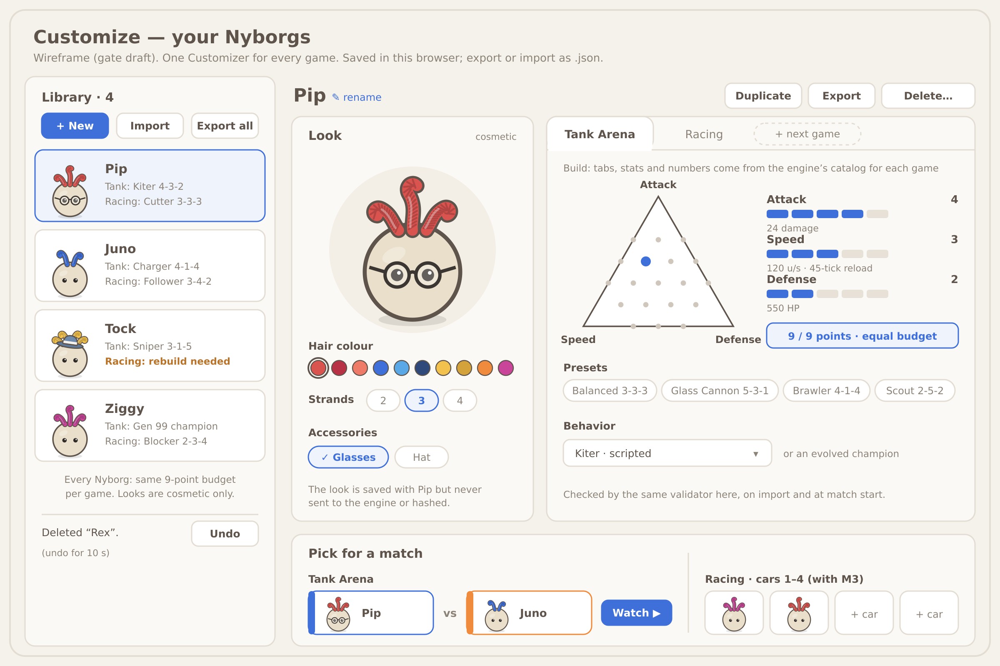

# Nyborg library and save format

**Status:** Draft for a gate (2026-10-03). Docs only: no code changes.
**Author:** Blitzwing (Tank Designer-Developer). The engine side was agreed with Shockwave (Engine Lead).
**Builds on:**
- [nyborg.md](nyborg.md): the look, cosmetics only (#44);
- [viewer-multi-game.md](viewer-multi-game.md): the shell, the per-game schema and V1–V4;
- [game-system.md](game-system.md): `catalogJson(game)` and M1–M5;
- [racing.md](racing.md) and [tank-refit.md](tank-refit.md).

**In one line:** you make as many Nyborgs as you like and keep them in a library in your browser. Each one has a look, plus a build and a behavior for each game. Every Nyborg plays on the same 9-point budget, and its look never reaches the sim.



*Source: [nyborg-library-wireframe.svg](nyborg-library-wireframe.svg). This is a wireframe, not final UI.*

## 1. The save format (version 1)
One Nyborg is one JSON object. The web side owns this format, and the engine never reads it.

```json
{
  "format": 1,
  "id": "7f3c2a9e-4b1d-4e8a-9c55-2d0f6b1a8e44",
  "name": "Pip",
  "created": "2026-10-03T15:20:00Z",
  "updated": "2026-10-03T15:31:12Z",
  "look": { "hair_color": "#D9534F", "strands": 3, "accessories": ["glasses"] },
  "builds": {
    "tank": {
      "rules_version": 1,
      "levels": { "attack": 4, "speed": 3, "defense": 2 },
      "behavior": { "kind": "scripted", "id": "kiter" }
    },
    "racing": {
      "rules_version": 1,
      "levels": { "power": 3, "top_speed": 3, "grip": 3 },
      "behavior": { "kind": "scripted", "id": "cutter" }
    }
  }
}
```

- **`format`:** the save format's version, an integer.
- **`id`:** a random UUID from `crypto.randomUUID()`. It is never reused, and duplicating a Nyborg gives it a new one.
- **`name`:** 1–24 characters, trimmed. It is always shown as text, never as HTML.
- **`created` and `updated`:** UTC ISO 8601 times.
- **`look`:** cosmetic only.
  - `hair_color` is one of nyborg.md's palette hexes.
  - `strands` is 2, 3 or 4.
  - `accessories` lists known ids (`glasses`, `hat`) with no repeats.
- **`builds[game]`:** one entry per game.
  - It stores **levels plus `rules_version`, not resolved values** (no HP or damage). The numbers always come from the engine's current tables.
  - A game with no entry uses that game's `defaultBuild` from the catalog. This covers a new Nyborg, or a game added after it was made.
- **`behavior`:** either `{kind: "scripted", id}`, using a scripted id from the catalog, or `{kind: "champion", ref}` (for example `{"kind": "champion", "ref": "tank/nightly/gen-99"}`).
  - A `ref` points at a published champion under `web/data/<game>/evolution/` (lineage and generation).
  - Every champion is open to every Nyborg.
- **Migration:**
  - A reader accepts every format from 1 up to its own.
  - It upgrades step by step, with one small pure function per bump (1→2, 2→3…), each tested on a saved example file.
  - It keeps a one-time backup of the old entries before it writes the new format. If any entry fails to upgrade, nothing is written.
  - A file from a *newer* format is shown read-only ("made by a newer version"), never overwritten.
  - Any new field means a format bump.

## 2. Storage: your browser, plus files
There is no server.

**localStorage keys** (prefixed, because every page on `starscream-agentics.github.io` shares one storage):

| Key | Holds |
|---|---|
| `arena.nyborg.index` | `{format, order: [ids], selected}` |
| `arena.nyborg.p.<id>` | one Nyborg (as above) |
| `arena.nyborg.picks` | who is in which match slot: `{tank: {blue, orange}, racing: {cars: [...]}}` |
| `arena.nyborg.backup.v<N>` | the one-time copy taken before a migration |

- **Size:** browsers allow about 5 MB per origin, shared with the other pages there. A Nyborg is under 1 KB, so the library is capped at **200 Nyborgs**. Each one is written to its own key, so a failed write can't damage the others.
- **Storage full** (`QuotaExceededError`): the change stays on screen, and a banner says "Couldn't save: browser storage is full. Export your library to keep this change." Nothing else is ever deleted to make room.
- **A corrupt entry** (bad JSON or failed validation): it isn't loaded. The list shows "1 Nyborg couldn't be read", with "Download raw" and "Remove". Nothing is deleted automatically.
- **Storage blocked** (some private modes): the Customizer still works for the session, and a banner explains that nothing will be saved.
- **Export:**
  - one Nyborg as `pip.nyborg.json` (the object above);
  - the whole library as `nyborgs-2026-10-03.json`, which is `{format, exported, nyborgs: [...]}`.
- **Import:**
  - It takes either file type, up to 1 MB and 200 Nyborgs.
  - Every Nyborg goes through **the same validator as the Customizer** (section 4).
  - If an id already exists, you choose "Replace" or "Keep both" (which gives a new id).

## 3. The Customizer: one for every game
- **Library list:** each Nyborg shows its preview, its name and a one-line build per game, with **+ New**, **Import** and **Export all** at the top.
- **Create:**
  - The new Nyborg is named "Nyborg 5" (or the next free number).
  - It gets the default look (Yarn Red, 3 strands, no accessories).
  - Each game starts at its catalog's `defaultBuild` (3/3/3) with the first scripted behavior.
- **Duplicate** copies everything except the id, and the copy is named "Pip copy". **Rename** edits the name in place.
- **Delete:** one confirm ("Delete Pip?"). An **Undo** toast then stays up for 10 s, and the Nyborg is only removed once it closes.
- **Edit the look:**
  - hair colour swatches, strands 2/3/4, and accessory toggles;
  - a live idle preview in the yarn-strand style;
  - a note that the look is cosmetic.
- **Edit each game's build:**
  - **Tabs:** one game tab per entry in the engine's `games()`. Racing appears when racing lands, and later games add a tab with no new UI code.
  - **What the tab draws from the game's `catalogJson(game)`:**
    - the three stats as the triangle widget, plus level pips;
    - the readout values per level;
    - "9 / 9 points";
    - the presets and the behavior picker.
  - Today's triangle already works over any three stats, so it becomes the schema-driven widget for both games (viewer-multi-game.md §3).
- **Pick for a match:**
  - **Tank Arena:** Blue and Orange slots. **Racing:** Car 1–4 (2–4 in a race).
  - **Watch ▶** builds the match from each picked Nyborg's `builds[game]`. For tanks it is the same canonical link as today: `?seed=42&blue=kiter-5-3-1&orange=charger-4-1-4`.
  - Links carry builds, not Nyborgs, so a shared link plays the same match for anyone.
- **Rules change** (`rules_version_mismatch`): that game's line shows "rebuild needed", and the tab offers **Rebuild with defaults**. The build is never fixed silently. Until you rebuild it, that Nyborg can't be picked for that game.

## 4. Equal footing, enforced in every game
- **One source of truth:** each game's catalog sets its stats, the range (levels 1–5, at least 1 per stat, 1 point per level) and the budget (exactly 9 points). The UI never hardcodes a number.
- **One validator, three places:** the engine's `validateBuild(game, buildJson)` runs:
  - in the Customizer;
  - on import;
  - at match start, inside the wasm.

  The web check is only a convenience. The wasm check at match start is the one that counts, so a hand-edited or tampered file can't get past it.
- **Never an advantage:**
  - an invalid build (`over_budget`, `out_of_range`, `unknown_key`, `wrong_game`, `unknown_behavior`) is rejected;
  - on import it is replaced by the catalog's `defaultBuild`, with a note saying which game;
  - points are never "spread" to make a bad build fit.
- **No pay-to-win:** nothing is bought. Every behavior and every published champion is open to every Nyborg.
- **Cosmetics never reach the sim:**
  - `look` is never passed to the engine, never stored in a replay and never hashed.
  - The engine only ever sees `builds[game]`.
  - Two Nyborgs with the same build and behavior play exactly the same match, whatever they look like.

## 5. Engine side: agreed with Shockwave (engine-wasm, his)
1. **`games()`** lists the game ids with their `rules_version`.
2. **`catalogJson(game)`** returns `{game, rules_version, budget: 9, stats: [{key, label, levels, cost_per_level, values per level}], behaviors: [scripted ids], defaultBuild, presets}`. It is generated from the games' own tables (`games/tank/src/loadout.rs` for tanks), so the UI never hardcodes a number.
3. **`validateBuild(game, buildJson)`** returns the normalized params and the points spent, or one error code: `over_budget`, `out_of_range`, `unknown_key`, `wrong_game`, `rules_version_mismatch` or `unknown_behavior`.
4. **Match setup also calls `validateBuild`** and takes one validated build per tank. This is the same path `TankSpawn.params` uses today, so tank matches, replays and pins come out byte-identical.
5. **Stat keys:**
   - **Tank:** `attack`/Attack, `speed`/Speed, `defense`/Defense.
   - **Racing:** `power`/Power, `top_speed`/Top speed, `grip`/Grip.
   - **Both:** levels 1–5, 1 point per level, at least 1 per stat, a budget of exactly 9.

**Still to confirm with Shockwave** (not agreed yet):
- How `validateBuild` checks a `champion` behavior, once the web side has resolved the ref to a genome (the gene bounds, as in `Genome::from_json`).
- Whether an error should name the key it failed on, so the UI can say which stat is wrong.

## 6. Cleanup: from today's tank-only tab to one Customizer
- **Today:** the Customize tab is tank-only. It lives in `renderCustomize` in `web/arena.js`, with the triangle in `web/tank-ui.js` and the data from `tankCatalogJson`.
- **The path:**
  1. V1 moves the tank code into `web/games/tank.js`, with no visible change.
  2. The triangle reads its stats from `catalogJson("tank")`.
  3. The library and the profile module go in, and Customize becomes the Customizer.
- **Old URLs keep working, byte for byte:**
  - `?tab=customize` still opens Customize.
  - A tank link with no Nyborgs plays as today, with default looks. It saves nothing unless you choose "Save as Nyborg".
  - The canonical tank link never changes form.
- **Tank pins don't move:**
  - No rule, table or replay change.
  - The tank build maps to exactly today's `Loadout::params`.
  - The replay format stays 4.
  - Every PR in this series passes `check-viewer.mjs` (16,923 checks), `check-parity.mjs` (7 fixtures), `check-viewer-browser.py` and the bot and champion pins unchanged.

**Milestones** (these follow nyborg.md's N1–N3; web-side, Blitzwing):

| | What | Needs | Accepted when |
|---|---|---|---|
| **N4** | Save format 1, the validator, localStorage, export and import | items 1–4 above for tank | Validator tests for every error code; a corrupt or tampered file never loads with an advantage; old URLs unchanged |
| **N5** | One Customizer for tank: library, look editor, schema-driven tank tab, pick for a match | N4, V1 | Viewer checks unchanged; tank links and hashes byte-identical |
| **N6** | Racing tab and car slots | racing R1–R2 (M3), `catalogJson("racing")` | Racing builds round-trip; an invalid setup can't start a race |
| **N7** | Nyborgs shown in Watch for both games | N2, V2 | Draws stay off the tick loop; replays unchanged |

**How this fits the new order** (M1 → M2 → M3 racing → M4 → M5, with Soundwave confirming the final order):
- N4 and N5 are tank-only and web-side, so they can run during M3 alongside racing R1–R2.
- N6 closes out M3, once racing's catalog exists.
- N7 lands with racing Watch (V2).
- None of this waits on the Python bridge (M4).

## 7. Open questions for Nye
1. **Champions:** when a Nyborg picks an evolved champion, does it take the champion's own build (locked), or keep its own levels? Both stay within 9 points.
2. **Shared links:** should a link also carry the Nyborgs' looks, so a friend sees Pip? Or should links stay build-only, with looks kept on your device?
3. **Starter library:** start with one default Nyborg, or with a few ready-made ones (one per behavior)?
4. **Seeing races sooner:** pull racing Watch (V2) into M3, so you can watch races as soon as the baselines exist?
5. **Backups:** are browser storage plus export and import enough for now? Accounts or cloud sync would be a separate gate.
