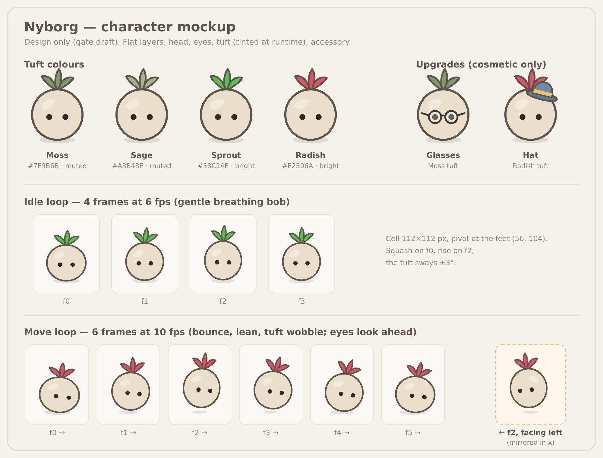

# Nyborgs: character design

**Status:** Design draft for a gate (2026-10-03). Naming and design only. Nothing in the code is renamed, and nothing in the sim, the replays or evolution changes.
**Author:** Blitzwing (Tank Designer-Developer). Fits [game-system.md](game-system.md) and [viewer-multi-game.md](viewer-multi-game.md).

**In one line:** a Nyborg is a little character with a round head, dot eyes and a tuft of hair like a vegetable top. The same Nyborg can train in any arena, driving a tank in Tank Arena and a car in Racing.

*Source: [nyborg-mockup.svg](nyborg-mockup.svg). This is a mockup, not final art.*

## 1. Look
- **A round head** with a soft dark outline and a faint highlight. There is no body: the head *is* the Nyborg.
- **Two dot eyes,** set a little apart at the middle of the head. When a Nyborg moves, its eyes shift slightly toward where it's going.
- **A tuft on top:** three leaves, like a sprout or a radish top. It is the main thing you customize.
- **Flat shapes,** with no gradients or texture, so a Nyborg stays readable at the size of a tank on the 800 × 600 arena.

## 2. Customization (cosmetic only)
- **Tuft color,** plus **upgrades** such as glasses and hats.
- **Cosmetics never touch training.** They live apart from the training stats (the tank's 9-point loadout, racing's car setup). The sim, replays, state hashes and evolution never see them, so two Nyborgs with the same build and policy play exactly the same match.
- **Default palette:** quiet colors by default, with a few bright tufts to choose from.

| Part | Default | Other options |
|---|---|---|
| Head | Oat `#EADFCB` | Pebble `#D9D3C9`, Mist `#D2DBDF` |
| Tuft, muted | **Moss `#7F9B6B`** (default) | Sage `#A3B48E`, Olive `#8C8A55`, Clay `#B5836A` |
| Tuft, bright | — | Sprout `#58C24E`, Radish `#E2506A`, Carrot `#F08A2E`, Plum `#8C5BD8` |
| Outline, eyes | Outline `#5E544B`, eyes `#2F2A26` | fixed |
| Upgrades (mockup) | glasses `#3B3632`; hat `#6E8BAE` with a `#E9C46A` band | more later |

## 3. Animation (v1: 2D, two loops)
| Loop | Frames | fps | Length | What moves |
|---|---|---|---|---|
| **Idle** | 4 | 6 | 0.67 s | A gentle bob: a squash on frame 0 and a rise on frame 2. The tuft sways ±3°. |
| **Move** | 6 | 10 | 0.6 s | A bounce up to 8 px, a 6–7° lean forward, a tuft wobble of about ±12° that lags the bounce, and the eyes looking ahead. |

- **Why these numbers:** 6 fps keeps the idle calm, because faster looks fidgety at 4 frames. 10 fps keeps the move lively without needing more frames, and 0.6 s per step reads well at tank speeds (120 u/s at Speed 3).
- **Facing:** sprites are drawn facing right. A Nyborg facing left is the same frame mirrored in x around its pivot.
- **No jitter when turning:** to stop it flipping back and forth, it only turns once the sideways speed passes about 0.5 u/tick in the new direction, and has stayed there for at least 6 ticks. Below that, it keeps its last facing.
- **Layers flip together.** The flip is one transform applied to the whole stack, so the tuft, eyes and accessory stay lined up. A hat tilted to the right ends up tilted to the left, and that's intended.

## 4. Asset format (for the web/wasm viewer; the pipeline comes after the gate)
- **Separate layers:** base head, tuft, eyes, accessory. All four are drawn on the same grid.
- **Tuft color at runtime:** the tuft sheet is grayscale and is tinted when it's drawn on the canvas. So there's one sheet for every color, and a new color is just a new hex value.
- **Grid:**
  - each cell is 112 × 112 px, with the pivot at the feet (56, 104);
  - each sheet has one row per loop: row 0 idle (4 cells), row 1 move (6 cells);
  - a 2× sheet for sharp screens.
- **Manifest** `nyborg.json`:
  - the cell size and pivot;
  - for each loop, its row, frame count and fps;
  - for each frame, its offset and the attach points for `hat` and `glasses`, so an accessory follows the bob and the lean.
- **Files:**
  - SVG sources in the repo, under `web/assets/nyborg/src/`;
  - PNG sheets for runtime, under `web/assets/nyborg/` (`head.png`, `tuft.png`, `eyes.png`, `acc-*.png` and `nyborg.json`).
  - The mockup's SVG already uses this layering, and tints the tuft by its fill.
- **Viewer only.** Nyborgs are drawn on the viewer's canvas. Nothing about them reaches `engine`, `games/*` or `engine-wasm`'s sim calls, so determinism and the parity checks aren't touched.

## 5. One Nyborg, many arenas
| Part | Holds | Seen by the sim? |
|---|---|---|
| **Profile** | id, name, look (tuft color, accessories), lineage and generation | No: viewer data only |
| **Build for each arena** | Tank Arena: Attack / Speed / Defense (9 points). Racing: Power / Top speed / Grip (9 points). Later arenas add their own. | Yes, as today's loadout |
| **Policy for each arena** | the scripted behavior or the evolved champion that arena trained | Yes, as today |

- **In an arena,** the Nyborg rides its body: its head sits on the tank's hull, or in the car, and turns with the facing rule above. Its name is shown only if Nye wants that (question 3).
- **The sim only sees the build and the policy:**
  - Tank links (`?seed=42&blue=kiter-5-3-1&orange=charger-4-1-4`) stay exactly as they are.
  - The replay format stays 4, and nothing about the look reaches a hash.
  - The rules in [tank-refit.md](tank-refit.md) still hold.
- **Customize** grows from today's per-game schema to a per-Nyborg profile with a build for each arena, as in the viewer-multi-game.md "Direction" note.

**Where it fits.** These are viewer-only steps. Like V1 and V4, they sit outside the approved order (M1 → M2 → M4 → M3 → M5) and jump nothing:

| | What | When | Accepted when |
|---|---|---|---|
| **N1** | The asset pipeline (SVG → PNG sheets + manifest), and a Nyborg preview with idle and move in the Customize tab | after this gate, alongside V1 | Viewer checks pass unchanged; tank links and hashes unchanged |
| **N2** | The Nyborg's head on each tank in Watch, with facing and flip | after V1 | Same; draws stay off the sim's tick loop |
| **N3** | The Nyborg profile across arenas, plus look and Gen in the shared badge | with V4, then M5 for racing | One profile shows in both arenas; replays unchanged |

## 6. Open questions for Nye
1. **Accessories:** how many at once? One hat and one pair of glasses is the simple start.
2. **Upgrades:** are they earned through training (e.g. a hat at Gen 50), or free cosmetics from day one?
3. **Names:** should a Nyborg's name show above its head in Watch?
4. **Placement:** does the head sit *on* the tank or car, or float beside it?
5. **Palette:** are the defaults right, with quiet Moss as the starting tuft and the four bright tufts as options?
