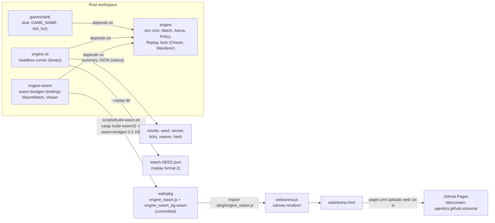

# Engine docs

The arena runs on a small deterministic 2D simulation written in Rust (`engine/`). It steps
at a fixed 60 Hz, takes all its randomness from one seeded RNG, and records every match as a
replay that re-simulates to the same state. The same crate runs headless in `engine-cli`
(CI's source of truth) and in the browser through `engine-wasm` and `web/arena.html`.

These pages describe the code on `main`. Where a page says what a function does, it comes from
reading that function; the rustdoc (`cargo doc --no-deps -p engine --open`) has the same facts
next to the code.

**Current shape, stated plainly:** the engine is tank-shaped today. Tanks, projectiles, the tank
`Observation`/`Action` pair, `TankParams` and the two placeholder bots all live in `engine/`.
`games/tank` is a stub (a `GAME_NAME` constant and `tick_hz()`), waiting for the Tank Arena
spec (GATE-002). ADR-009 says tank specifics should live in `games/tank`; the code has not been
split that way yet.

## Architecture

Data flow in one line each:

- **Headless:** `engine-cli` builds `MatchConfig::duel()` matches, drives them with `Chaser` vs
  `Wanderer`, prints a JSON summary, and optionally writes one replay per match.
- **Browser:** `arena.js` creates a `WasmMatch` (seed string + two bot names), calls `step(n)`
  from its animation loop, and draws the JSON from `stateJson()` on a canvas.
- Nothing depends on `games/tank` yet.

## Pages

| Page | What it covers |
| --- | --- |
| [World](world.md) | Arena, coordinates, headings, tanks, projectiles, `TankParams`, `MatchConfig::duel`, events, end conditions |
| [Tick loop](tick-loop.md) | The fixed 60 Hz step, the exact order of work inside `Match::step`, how callers drive it |
| [Seeds and determinism](determinism.md) | The ChaCha8 RNG and what draws from it, simultaneous movement, trig table, state hash, JS-safe string seeds |
| [Observations, actions and policies](policies.md) | `Observation`, `Action`, the `Policy` trait, and the built-in `Chaser` and `Wanderer` |
| [Replay format](replay-format.md) | `REPLAY_FORMAT` 2 field by field, versioning, `verify`, `ReplayPlayer` |
| [engine-cli](engine-cli.md) | Flags, output, replay files, examples |
| [engine-wasm and the web viewer](wasm-and-web.md) | The JS API, building `web/pkg`, relative paths, the CI check, Pages deploy |

Related: [ADR-001, -003, -008, -009](../DECISIONS.md) in `docs/DECISIONS.md`.
