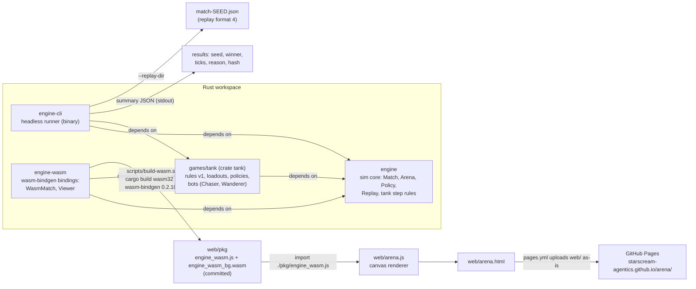

# Engine docs

The arena runs on a small deterministic 2D simulation written in Rust (`engine/`). It steps
at a fixed 60 Hz, takes all its randomness from one seeded RNG, and records every match as a
replay that re-simulates to the same state. The same crate runs headless in `engine-cli`
(CI's source of truth) and in the browser through `engine-wasm` and `web/arena.html`.

These pages describe the code on `main`. Where a page says what a function does, it comes from
reading that function; the rustdoc (`cargo doc --no-deps -p engine --open`) has the same facts
next to the code.

**Current shape, stated plainly:** the engine is tank-shaped today. Tanks, projectiles, the tank
step rules, the tank `Observation`/`Action` pair and `TankParams` live in `engine/`.
`games/tank` (crate `tank`) builds on them: the Tank Arena rules v1 (loadouts, the pillar arena
and spawns, the charger, kiter and sniper policies; #18) and, since ADR-014 Phase A, the two
placeholder bots `Chaser` and `Wanderer`. The Tank Arena spec (`games/tank/SPEC.md`, GATE-002)
is merged, and the engine side of its asks is in: line of sight, per-tank params, `max_hp` and
`los` in observations, optional stationary accuracy (replay format 4). ADR-009 plans for tank
specifics to live in `games/tank`; its 2026-09-30 correction records that they are in `engine/`
today and that the move is future work.
[ADR-014](../DECISIONS.md) (Accepted) plans how. Only step B1 is approved: a generic core with a `Rules` trait, with the tank rules still in `engine/`. Moving them to `games/tank` is deferred until a second Rust game exists.

## Architecture

Data flow in one line each:

- **Headless:** `engine-cli` builds `MatchConfig::duel()` matches, drives them with
  `tank::Chaser` vs `tank::Wanderer`, prints a JSON summary, and optionally writes one replay
  per match.
- **Browser:** `arena.js` creates a `WasmMatch` (seed string + two bot names, or
  `WasmMatch.tank(query)` for a Tank Arena duel), calls `step(n)` from its animation loop, and
  draws the JSON from `stateJson()` on a canvas.
- `engine-cli` and `engine-wasm` depend on `games/tank`; `engine` does not, and can't (that
  would be a crate cycle, ADR-014).

## Pages

| Page | What it covers |
| --- | --- |
| [World](world.md) | Arena, coordinates, headings (64-BAU aim resolution), line of sight, tanks, projectiles, `TankParams`, per-tank params, stationary accuracy, `MatchConfig::duel`, events, end conditions |
| [Tick loop](tick-loop.md) | The fixed 60 Hz step, the exact order of work inside `Match::step`, how callers drive it |
| [Seeds and determinism](determinism.md) | The ChaCha8 RNG and what draws from it, simultaneous movement, trig table, the one `sqrt`, state hash, JS-safe string seeds |
| [Observations, actions and policies](policies.md) | `Observation` (including `max_hp` and `los`), `Action`, the `Policy` trait, and the placeholder `Chaser` and `Wanderer` (in `games/tank`) |
| [Replay format](replay-format.md) | `REPLAY_FORMAT` 4 field by field, the setup hash, versioning (formats 2 and 3 still read), `verify`, `ReplayPlayer` |
| [engine-cli](engine-cli.md) | Flags, output, replay files, examples |
| [engine-wasm and the web viewer](wasm-and-web.md) | The JS API (including `withConfig` and `duelConfigJson`), building `web/pkg`, relative paths, the CI check, Pages deploy |

Related: [ADR-001, -003, -008, -009, -014](../DECISIONS.md) in `docs/DECISIONS.md`.
